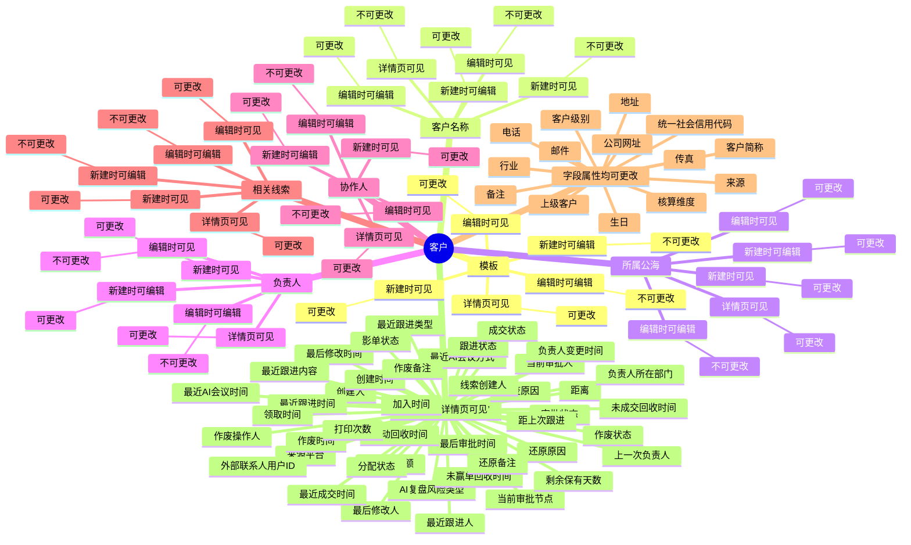
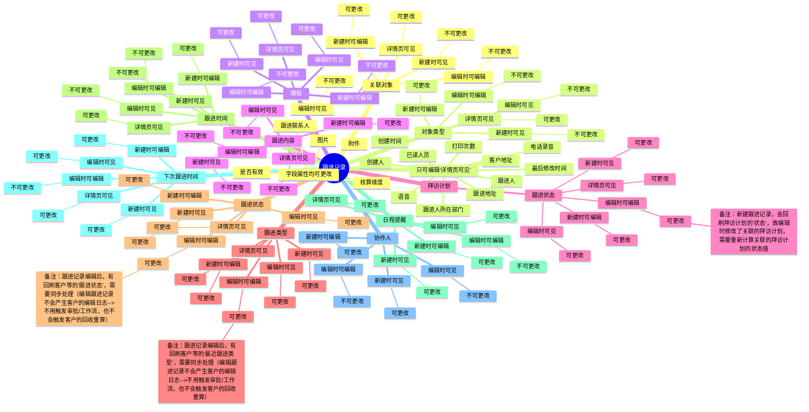
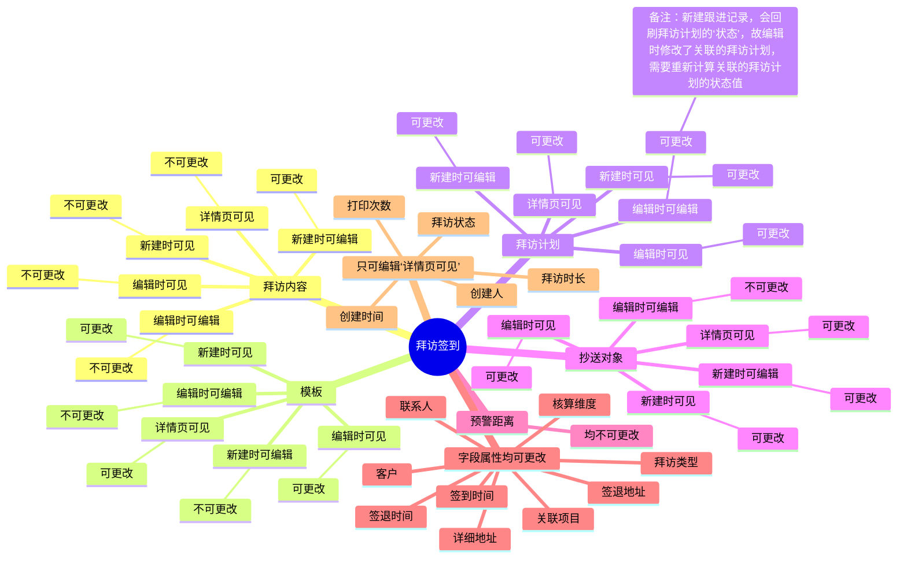
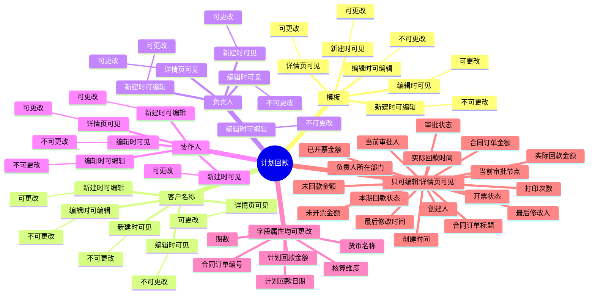

##### **1、客户**

```mermaid
mindmap
  root((客户))
    模板
      新建时可见
        可更改
      编辑时可见
        可更改
      新建时可编辑
        不可更改
      编辑时可编辑
        不可更改
      详情页可见
        可更改
    客户名称
      新建时可见
        不可更改
      编辑时可见
        不可更改
      新建时可编辑
        可更改
      编辑时可编辑
        可更改
      详情页可见
        不可更改
    所属公海
      新建时可见
        可更改
      编辑时可见
        可更改
      新建时可编辑
        可更改
      编辑时可编辑
        不可更改
      详情页可见
        可更改
    负责人
      新建时可见
        可更改
      编辑时可见
        不可更改
      新建时可编辑
        可更改
      编辑时可编辑
        不可更改
      详情页可见
        可更改
    协作人
      新建时可见
        可更改
      编辑时可见
        不可更改
      新建时可编辑
        可更改
      编辑时可编辑
        不可更改
      详情页可见
        可更改
    相关线索
      新建时可见
        可更改
      编辑时可见
        可更改
      新建时可编辑
        不可更改
      编辑时可编辑
        不可更改
      详情页可见
        可更改
    字段属性均可更改
      客户简称
      统一社会信用代码
      行业
      来源
      客户级别
      上级客户
      地址
      生日
      电话
      传真
      公司网址
      邮件
      备注
      核算维度
    只可编辑‘详情页可见’
      来源平台
      外部联系人用户ID
      审批状态
      当前审批人
      当前审批节点
      最后审批时间
      应收款余额
      距离
      最近AI会议时间
      最近AI会议方式
      AI复盘风险类型
      负责人所在部门
      创建人
      创建时间
      最后修改人
      最后修改时间
      最近跟进类型
      最近跟进时间
      最近跟进人
      跟进状态
      最近跟进内容
      距上次跟进
      成交状态
      影单状态
      最近成交时间
      分配状态
      作废状态
      作废操作人
      作废时间
      作废原因
      作废备注
      加入时间
      领取时间
      自动回收时间
      未赢单回收时间
      未成交回收时间
      剩余保有天数
      线索创建人
      上一次负责人
      负责人变更时间
      打印次数
      还原原因
      还原备注
```

##### **2、跟进记录**

```mermaid
mindmap
  root((跟进记录))
    关联对象
      新建时可见
        不可更改
      编辑时可见
        不可更改
      新建时可编辑
        可更改
      编辑时可编辑
        不可更改
      详情页可见
        可更改
    对象类型
      新建时可见
        不可更改
      编辑时可见
        不可更改
      新建时可编辑
        可更改
      编辑时可编辑
        不可更改
      详情页可见
        可更改
    模板
      新建时可见
        可更改
      编辑时可见
        可更改
      新建时可编辑
        不可更改
      编辑时可编辑
        不可更改
      详情页可见
        可更改
    跟进内容
      新建时可见
        不可更改
      编辑时可见
        不可更改
      新建时可编辑
        可更改
      编辑时可编辑
        不可更改
      详情页可见
        不可更改
    拜访计划
      跟进状态
        新建时可见
          可更改
        编辑时可见
          可更改
        新建时可编辑
          可更改
        编辑时可编辑
          可更改
            备注：新建跟进记录，会回刷拜访计划的‘状态’，故编辑时修改了关联的拜访计划，需要重新计算关联的拜访计划的状态值
        详情页可见
          可更改
    跟进类型
      新建时可见
        可更改
      编辑时可见
        可更改
      新建时可编辑
        可更改
      编辑时可编辑
        可更改
          备注：跟进记录编辑后，有回刷客户等的‘最近跟进类型’，需要同步处理（编辑跟进记录不会产生客户的编辑日志-->不用触发审批/工作流，也不会触发客户的回收重算）
      详情页可见
        可更改
    跟进状态
      新建时可见
        可更改
      编辑时可见
        可更改
      新建时可编辑
        可更改
      编辑时可编辑
        可更改
          备注：跟进记录编辑后，有回刷客户等的‘跟进状态’，需要同步处理（编辑跟进记录不会产生客户的编辑日志-->不用触发审批/工作流，也不会触发客户的回收重算）
      详情页可见
        可更改
    跟进时间
      新建时可见
        不可更改
      编辑时可见
        不可更改
      新建时可编辑
        可更改
      编辑时可编辑
        不可更改
      详情页可见
        可更改
    日程提醒
      新建时可见
        可更改
      编辑时可见
        可更改
      新建时可编辑
        可更改
      编辑时可编辑
        不可更改
      详情页可见
        可更改
    下次跟进时间
      新建时可见
        可更改
      编辑时可见
        可更改
      新建时可编辑
        可更改
      编辑时可编辑
        不可更改
      详情页可见
        可更改
    协作人
      新建时可见
        可更改
      编辑时可见
        不可更改
      新建时可编辑
        可更改
      编辑时可编辑
        不可更改
    字段属性均可更改
      是否有效
      核算维度
      跟进联系人
      图片
      附件
    只可编辑‘详情页可见’
      客户地址
      跟进地址
      跟进人
      跟进人所在部门
      创建人
      创建时间
      最后修改时间
      打印次数
      已读人员
      语音
      电话录音
```

##### **3、拜访签到**

```mermaid
mindmap
  root((拜访签到))
    拜访内容
      新建时可见
        不可更改
      编辑时可见
        不可更改
      新建时可编辑
        可更改
      编辑时可编辑
        不可更改
      详情页可见
        不可更改
    模板
      新建时可见
        可更改
      编辑时可见
        可更改
      新建时可编辑
        不可更改
      编辑时可编辑
        不可更改
      详情页可见
        可更改
    拜访计划
      新建时可见
        可更改
      编辑时可见
        可更改
      新建时可编辑
        可更改
      编辑时可编辑
        可更改
          备注：新建跟进记录，会回刷拜访计划的‘状态’，故编辑时修改了关联的拜访计划，需要重新计算关联的拜访计划的状态值
      详情页可见
        可更改
    抄送对象
      新建时可见
        可更改
      编辑时可见
        可更改
      新建时可编辑
        可更改
      编辑时可编辑
        不可更改
      详情页可见
        可更改
    预警距离
      均不可更改
    字段属性均可更改
      核算维度
      客户
      联系人
      关联项目
      详细地址
      签到时间
      签退时间
      签退地址
      拜访类型
    只可编辑‘详情页可见’
      打印次数
      创建人
      创建时间
      拜访时长
      拜访状态
```

4、计划回款

```mermaid
mindmap
  root((计划回款))
    模板
      新建时可见
        可更改
      编辑时可见
        可更改
      新建时可编辑
        不可更改
      编辑时可编辑
        不可更改
      详情页可见
        可更改
    客户名称
      新建时可见
        不可更改
      编辑时可见
        不可更改
      新建时可编辑
        可更改
      编辑时可编辑
        不可更改
      详情页可见
        可更改
    负责人
      新建时可见
        可更改
      编辑时可见
        不可更改
      新建时可编辑
        可更改
      编辑时可编辑
        不可更改
      详情页可见
        可更改
    协作人
      新建时可见
        可更改
      编辑时可见
        不可更改
      新建时可编辑
        可更改
      编辑时可编辑
        不可更改
      详情页可见
        可更改
    字段属性均可更改
      计划回款金额
      核算维度
      计划回款日期
      货币名称
      期数
      合同订单编号
    只可编辑‘详情页可见’
      合同订单标题
      合同订单金额
      实际回款金额
      实际回款时间
      未回款金额
      已开票金额
      未开票金额
      开票状态
      本期回款状态
      负责人所在部门
      审批状态
      创建人
      创建时间
      最后修改人
      最后修改时间
      打印次数
      当前审批节点
      当前审批人
```

